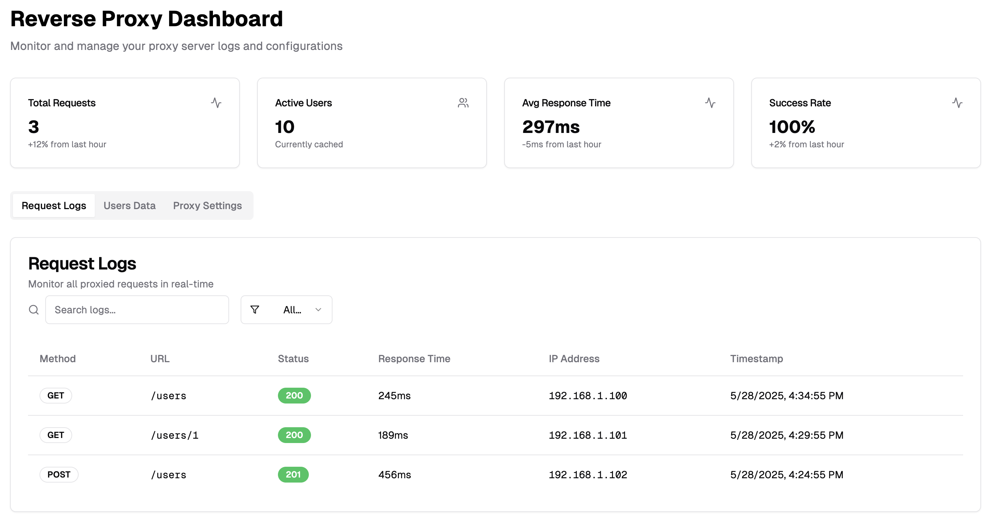
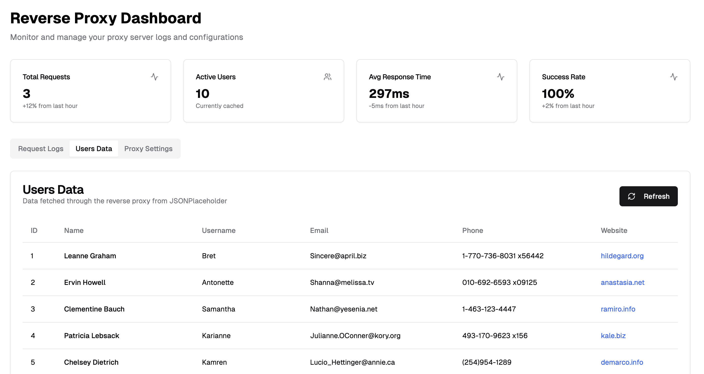
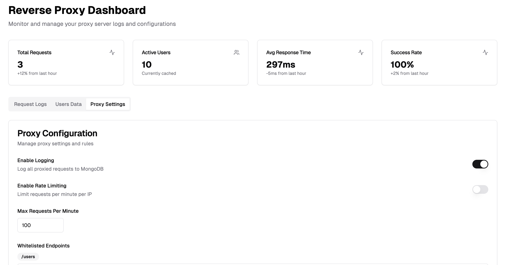

<!-- prettier-ignore-start -->
<div align="center">

<h1>🪞 Reverse-Proxy Logger Dashboard</h1>

⚡️ **MERN &nbsp;+&nbsp;TypeScript** • Tailwind&nbsp;+&nbsp;shadcn/ui • Dark Mode • JWT&nbsp;Auth

[](LICENSE)
[](https://nodejs.org/)
[](https://www.mongodb.com/)
[](https://vitejs.dev/)
[](https://www.typescriptlang.org/)

</div>
<!-- prettier-ignore-end -->

A full-stack demo that shows how to:

* spin up an **Express reverse proxy**,
* log every proxied request into **MongoDB**,
* fetch remote data (here, `/users` from *jsonplaceholder*) through the proxy,
* secure an **admin dashboard** with JWT auth,
* present real-time logs, stats cards, and dark-mode UI with **React 18, Vite, Tailwind, and shadcn/ui**.

---

## ✨ Screenshots

<h1>Logs</h1>


<h1>Users</h1>


<h1>Config</h1>


> **Tip:** Hit the in-app 🌙 / ☀️ toggle to switch instantly.

---

## 🚀 Quick Start

```bash
# 1  Clone & install workspace deps
git clone <repo-url>
cd reverse-proxy-logger
npm i

# 2  Configure MongoDB (default → mongodb://localhost:27017/proxylogger)
cp backend/.env.example backend/.env
# edit backend/.env if your URI differs

# 3  Run both servers
npm run start
# ➜  Backend @ localhost:5000
# ➜  Frontend @ localhost:3000

